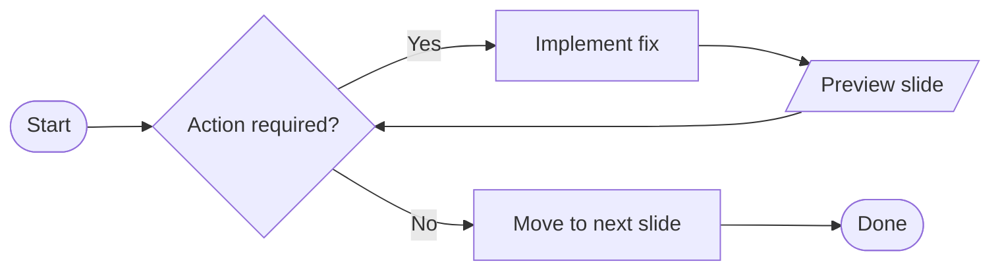

# Slidev Theme Starter

Presentation slides for developers

---

# What is Slidev?

Slidev is a slide maker and presentation tool designed for developers. It includes the following features:

- 📝 **Text-based** - focus on your content with Markdown, then style it later
- 🎨 **Themable** - themes can be shared and reused as npm packages
- 🧑‍💻 **Developer Friendly** - code highlighting, live coding with autocompletion
- 🤹 **Interactive** - embed Vue components to enhance your expressions
- 🎥 **Recording** - built-in recording and camera view
- 📤 **Portable** - export to PDF, PPTX, PNGs, or even a hostable SPA
- 🛠 **Hackable** - virtually anything that's possible on a webpage is possible in Slidev

<br>
<br>

Read more about [Why Slidev?](https://sli.dev/guide/why)

---

# Navigation

Hover on the bottom-left corner to see the navigation's controls panel

## Keyboard Shortcuts

|                                                      |                             |
| ---------------------------------------------------- | --------------------------- |
| <kbd>space</kbd> / <kbd>tab</kbd> / <kbd>right</kbd> | next animation or slide     |
| <kbd>left</kbd> / <kbd>shift</kbd><kbd>space</kbd>   | previous animation or slide |
| <kbd>up</kbd>                                        | previous slide              |
| <kbd>down</kbd>                                      | next slide                  |

---
layout: section
---

# Code Snippets

---
layout: image-right
image: https://cover.sli.dev
---

# Code with image

Use code snippets and get the highlighting directly!

```ts
interface User {
  id: number;
  firstName: string;
  lastName: string;
  role: string;
}

function updateUser(id: number, update: Partial<User>) {
  const user = getUser(id);
  const newUser = { ...user, ...update };
  saveUser(id, newUser);
}
```

---
layout: default
layoutClass: gap-x-sm
---

# Code

```typescript
export class MyModule {
  myState: unknown;
}
```

---
layout: default
layoutClass: gap-x-sm
---

# Code line numbers

```typescript{*}{lines:true}
export class MyModule {
  myState: unknown
}
```

---
layout: default
layoutClass: gap-x-sm
---

## Highlight single line

```typescript{2}{lines:true}
export class MyModule {
  myState: unknown
}
```

## Highlight multiple lines

```typescript{2,3}{lines:true}
export class MyModule {
  myState: unknown
  method(): void {}
}
```

## Navigate through lines

```typescript{1|2|3|4}{lines:true}
export class MyModule {
  myState: unknown
  method(): void {}
}
```

---
layout: default
---

# Code - Magic Move

````md magic-move
```ts
console.log("Hello, World!");
```

```js
console.log("Hello, World!");
console.log(`Step ${1}`);
```

```js
console.log("Hello, World!");
console.log(`Step ${1 + 1}`);
```

```ts
console.log("Hello, World!");
console.log(`Step ${3}` as string);
```
````

---
layout: default
---

# Code - Long Code Sample

```ts{*}{lines:true, maxHeight: '300px'}
console.log("1");
console.log("2");
console.log("3");
console.log("4");
console.log("4");
console.log("5");
console.log("6");
console.log("7");
console.log("8");
console.log("9");
console.log("10");
console.log("11");
console.log("12");
console.log("13");
console.log("14");
console.log("15");
console.log("16");
console.log("17");
console.log("18");
console.log("19");
console.log("20");
```

---
layout: two-cols-header
layoutClass: gap-x-sm
---

# Code on the `right`

::left::

- Explain important facts

::right::

```typescript
export class MyModule {
  myState: unknown;
}
```

---
layout: two-cols-header
layoutClass: gap-x-sm
---

# Code on the `left`

::left::

```typescript
export class MyModule {
  myState: unknown;
}
```

::right::

- Explain important facts

---
layout: two-cols-header
layoutClass: gap-x-sm
---

# Two code snippets next to each other

::left::

```typescript
export class MyModule {
  myState: unknown;
}
```

::right::

```html
<article>
  <h2>Hello, there</h2>
</article>
```

::bottom::

🔥 Important note on the button.

---
layout: two-cols-header
layoutClass: gap-x-sm
---

# Window `color`-theme

::left::

```typescript
export class MyModule {
  myState: unknown;
}
```

::right::

```html
<article>
  <h2>Hello, there</h2>
</article>
```

---
layout: section
image: /task.svg
imageClass: w-42
---

# Tasks

---
layout: section
---

# Tasks

---
layout: little-what
---

::heading::

## My Topic

::explanation::
This short primer tells the audience what the next topic is about.

---
layout: task
---

## Create your 1st component in your project

---
layout: section
---

# Diagram

<!-- My comment -->

<!--
M
-->

---
layout: default
---

# Mermaid



---
layout: section
---

# Learn More

[Documentation](https://sli.dev) / [GitHub Repo](https://github.com/slidevjs/slidev)
